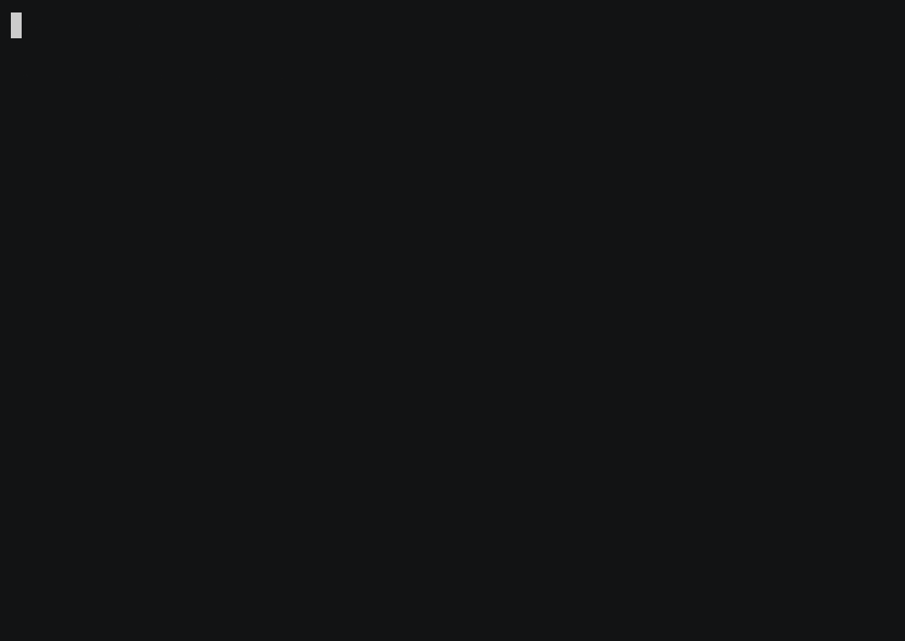

# 🐾 9lives

**Your tests have nine lives.** Self-healing QA for the coding-agent era, by [QualityMax](https://qualitymax.io).



> A coding agent renamed a button, the test went red, `9l heal` read the live page, fixed the locator, re-ran it green, and showed the diff — no API key. [**Run the demo yourself →**](demo/)

Your coding agent shipped a change and your Playwright test went red? Don't rewrite it — resurrect it:

```bash
9l heal login.spec.ts
```

`9l` runs the test, classifies the failure, and heals it in tiers:

1. **Tier 1 — offline, free, instant.** Selector drifted? 9lives finds the element again from the failure-time page snapshot (text, testid, id, class, aria-label) and rewrites the locator. No LLM, no network, no account.
2. **Tier 2 — the subscription you already pay for.** Structural change? 9lives shells out to your installed coding-agent CLI — **Claude Code (`claude -p`), Codex (`codex exec`), or OpenCode (`opencode run`)** — so your existing subscription does the thinking. No API key to mint, nothing to configure: if the CLI is logged in, healing works. (Prefer raw API? `ANTHROPIC_API_KEY` / `OPENAI_API_KEY` work too.)
3. **Always a diff, never a surprise.** Healed code is shown as a unified diff and applied only when you approve (or `--yes` in CI).

**Won't hide your bugs.** A failing *assertion* means the app's behavior changed — not that a selector moved. 9lives refuses to rewrite assertions to force a green (that's how naive auto-healers mask regressions) and flags it as a possible real bug instead. Opt in with `NINELIVES_HEAL_ASSERTIONS=1` if you really want it to propose an assertion update.

## Install

```bash
curl -sL 9lives.run | sh
pip install 9lives          # or: uv tool install 9lives
```

Requires Node.js ≥ 18 (Playwright itself runs on Node). Check your setup with `9l doctor`.

## Commands

```bash
9l run <spec>         # run a spec locally; screenshots/videos/traces in .9lives/
9l heal <spec>        # run → heal → re-run → diff → apply on confirm
9l heal <spec> --yes  # CI mode: apply automatically, exit code tells the story
9l doctor             # environment check
```

Works inside an existing Playwright project (uses your `package.json`) or on a bare `.spec.ts` file (scaffolds an ephemeral project automatically). All commands accept multiple specs/globs.

## In CI: the GitHub Action

```yaml
- uses: quality-max/9lives/action@v1
  with:
    specs: "tests/**/*.spec.ts"
    anthropic-api-key: ${{ secrets.ANTHROPIC_API_KEY }}
    commit-healed: "true"
```

Runs on **your** runner, heals with **your** key, posts a 🐾 report comment on the PR, and can commit healed specs straight back to the branch. See [`action/`](action/README.md).

## BYO everything

- **Your subscription:** an installed `claude` / `codex` / `opencode` CLI is auto-detected and used for Tier 2, so the subscription you already use for coding can heal tests too.
- **Or your key:** `ANTHROPIC_API_KEY` / `OPENAI_API_KEY`. Force a choice with `NINELIVES_PROVIDER` (`claude-code`, `codex`, `opencode`, `anthropic`, `openai`) and `NINELIVES_MODEL`.
- **Your runner:** everything executes on your machine or your CI. Nothing leaves it, nothing phones home.
- **No account.** Ever, for anything in this tool.

## Security & trust boundary

Tier 1 healing is fully offline and never sends anything anywhere.

Tier 2 builds its prompt from the failing test plus the **page snapshot captured at failure**. If you heal tests against a site you don't control, that page content becomes model input. In *subscription mode* it is handed to your local coding-agent CLI (`claude` / `codex` / `opencode`), which can run tools — so a hostile page could attempt prompt injection against your agent. 9lives runs the CLI in an empty scratch directory to limit blast radius, but if you heal against untrusted targets, force plain API mode (no agent tools) with:

```
NINELIVES_PROVIDER=anthropic   # or openai
```

## Roadmap

- `9l check` — map your git diff to affected user flows, run/generate targeted tests: *"did my agent break anything?"*
- `9lives-action` — GitHub Action that posts the QA report on PRs, healed commits included
- `9l gen <url>` — crawl a live app and generate a starter test suite

## Status

**v0.1 prototype** — built by [QualityMax](https://qualitymax.io) for local, BYO self-healing Playwright workflows. MIT licensed.
