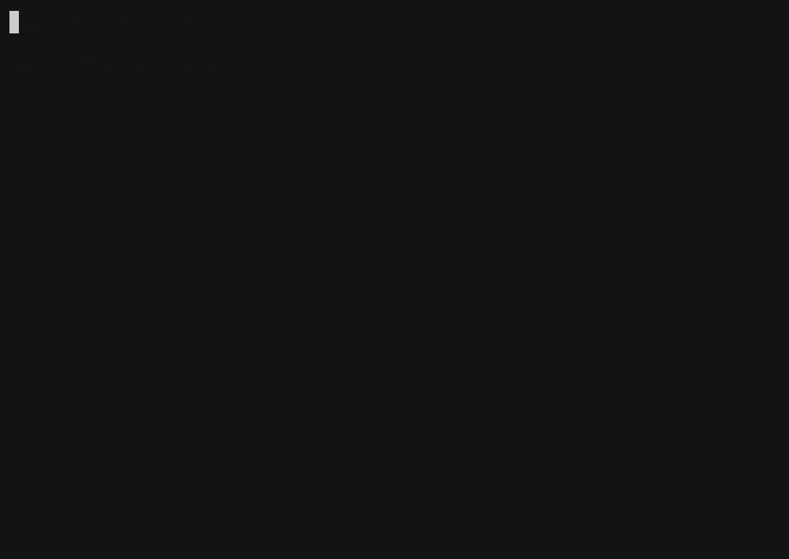

# 🐾 9lives demo — watch a test heal itself

This is the Python compatibility demo. For the primary Go runner and a current Playwright example, start at the [published runner site](https://quality-max.github.io/9lives-runner/) and [Go demo](https://github.com/Quality-Max/9lives-runner/tree/main/demo). See the [migration guide](../docs/MIGRATING_TO_GO.md) before replacing Python workflows.

A coding agent renamed a button from **“Sign In”** to **“Sign in”**, and the
Playwright test went red. `9lives heal` reads the live page, finds the element under
its new label, patches the spec, re-runs it green, and shows you the diff — all
**offline** (Tier 1, no API key).



## Run it yourself (one command)

```bash
pip install 9lives            # or: uvx --from 9lives 9lives ...
cd demo && ./heal.sh
```

`heal.sh` serves the tiny local page in [`site/`](site/index.html), then runs
`9lives heal login.spec.js`. The spec ships **broken** on purpose:

```js
await page.locator("text='Sign In'").click();   // page now says "Sign in"
```

You'll watch it become `text='Sign in'` and pass. `git checkout -- login.spec.js`
resets it to broken so you can run the demo again.

## Regenerate the GIF

```bash
./record.sh        # asciinema + agg → heal.gif  (deps: asciinema, agg, 9lives, node)
```
